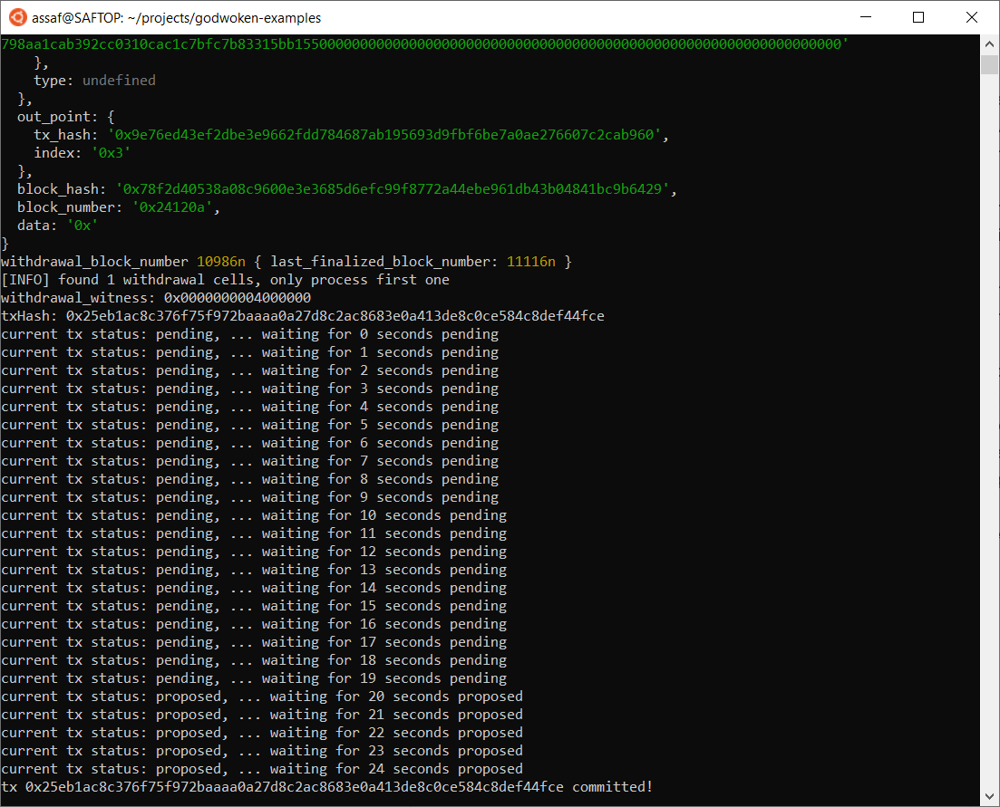

# Gitcoin: 10) Complete Withdrawal Process By Unlocking The Funds

## A screenshot of the console output immediately after running the "unlock" command.

## The Ethereum address that you've used for your Layer 2 account (in text format).
0xF858a3C815A4AF770b929B1Cc0022D38dB133142

## The Nervos Layer 1 address associated with the private key passed to "unlock" command (in text format). This is "ckb address" in the console output.
ckt1qyqwy3ttzkuq7jppjrf2f9jweqvnk3tmgcjs9w0jgy
