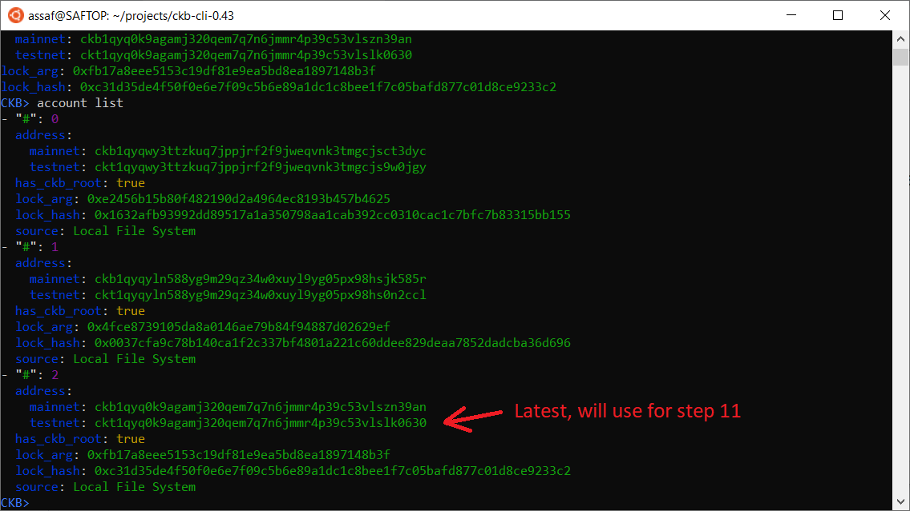
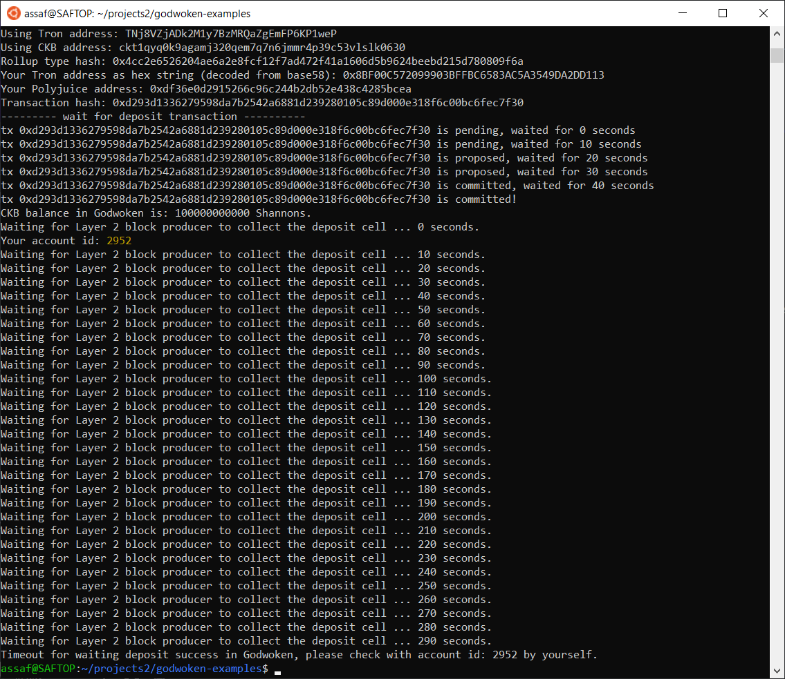
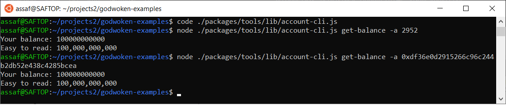
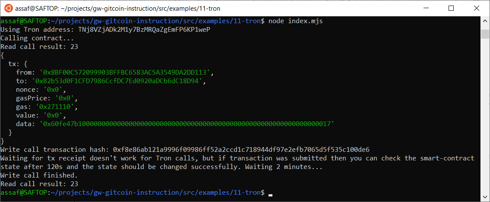

# Gitcoin: 11) Use A Tron Wallet To Execute A Smart Contract Call

## 1. A screenshot of the accounts you created (account list) in ckb-cli.


## 2. A link to the Layer 1 address you funded on the Testnet Explorer.
https://explorer.nervos.org/aggron/address/ckt1qyq0k9agamj320qem7q7n6jmmr4p39c53vlslk0630

## 3. A screenshot of the console output immediately after you have successfully submitted a CKByte deposit to your Tron account on Layer 2.


Seeing that the deposit went through:


## 4. A screenshot of the console output immediately after you have successfully issued a smart contract calls on Layer 2.


## 5. The transaction hash of the "Contract call" from the console output (in text format).
0xf8e86ab121a9996f09986ff52a2ccd1c718944df97e2efb7065d5f535c100de6

## 6. The contract address that you called (in text format).
0xB2b53d0F1CFD7986CcfDC7Ed0920aDCb6dC18D94

## 7. The ABI for contract you made a call on (in text format).
```
[
    {
      "inputs": [],
      "stateMutability": "payable",
      "type": "constructor"
    },
    {
      "inputs": [
        {
          "internalType": "uint256",
          "name": "x",
          "type": "uint256"
        }
      ],
      "name": "set",
      "outputs": [],
      "stateMutability": "payable",
      "type": "function"
    },
    {
      "inputs": [],
      "name": "get",
      "outputs": [
        {
          "internalType": "uint256",
          "name": "",
          "type": "uint256"
        }
      ],
      "stateMutability": "view",
      "type": "function"
    }
]
```

## 8. Your Tron address (in text format).
TNj8VZjADk2M1y7BzMRQaZgEmFP6KP1weP
