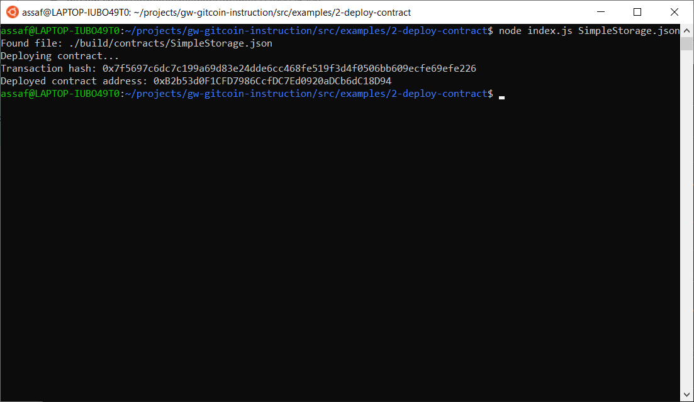

# Gitcoin: 2) Deploy A Simple Ethereum Smart Contract On Polyjuice

## 1. A screenshot of the console output immediately after you have successfully deployed a smart contract.

## 2. The transaction hash from the contract deployment (in text format).
0x7f5697c6dc7c199a69d83e24dde6cc468fe519f3d4f0506bb609ecfe69efe226

## 3. The deployed contract address from the contract deployment (in text format).
0xB2b53d0F1CFD7986CcfDC7Ed0920aDCb6dC18D94
