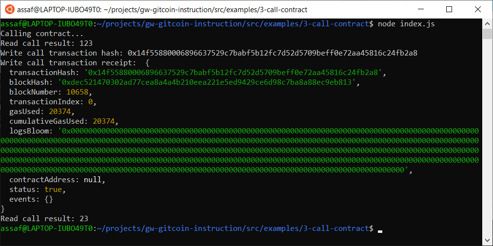

# Gitcoin: 3) Issue A Smart Contract Call To The Deployed Smart Contract

## 1. A screenshot of the console output immediately after you have successfully issued a smart contract call.


## 2. The transaction hash from the console output (in text format).
0x14f55880006896637529c7babf5b12fc7d52d5709beff0e72aa45816c24fb2a8

## 3. The contract address that you called (in text format).
0xB2b53d0F1CFD7986CcfDC7Ed0920aDCb6dC18D94

## 4. The ABI for contract you made a call on (in text format).
```
[
    {
      "inputs": [],
      "stateMutability": "payable",
      "type": "constructor"
    },
    {
      "inputs": [
        {
          "internalType": "uint256",
          "name": "x",
          "type": "uint256"
        }
      ],
      "name": "set",
      "outputs": [],
      "stateMutability": "payable",
      "type": "function"
    },
    {
      "inputs": [],
      "name": "get",
      "outputs": [
        {
          "internalType": "uint256",
          "name": "",
          "type": "uint256"
        }
      ],
      "stateMutability": "view",
      "type": "function"
    }
  ]
```
