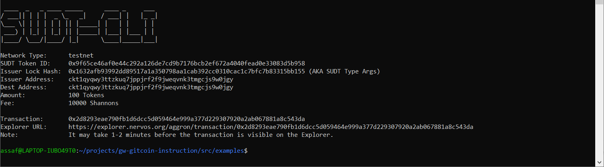
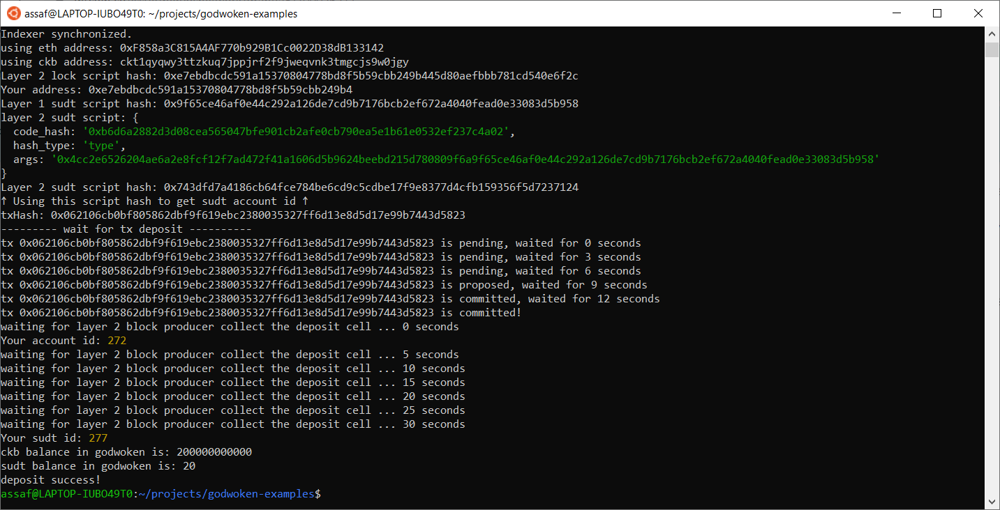

# Gitcoin: 4) Issue An SUDT Token On Layer 1 And Deposit It To Layer 2

## 1. A link to the Layer 1 address you funded on the Testnet Explorer.
https://explorer.nervos.org/aggron/address/ckt1qyqwy3ttzkuq7jppjrf2f9jweqvnk3tmgcjs9w0jgy

## 2. A screenshot of the console output immediately after using sudt-cli to create your SUDT tokens on Layer 1.

## 3. A link to the transaction ID created by sudt-cli on the Testnet Explorer.
https://explorer.nervos.org/aggron/transaction/0x2d8293eae790fb1d6dcc5d059464e999a377d229307920a2ab067881a8c543da

## 4. A screenshot of the console output immediately after you have successfully submitted a deposit to Layer 2 using the account-cli tool.

## 5. The SUDT ID from the console output after executing the deposit script (in text format).
277
