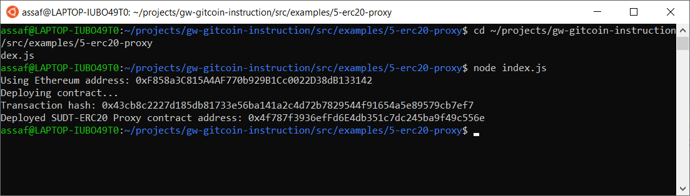
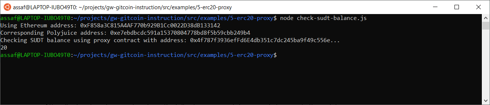

# Gitcoin: 5) Deploy The ERC20 Proxy Contract For The Deposited SUDT

## 1. A screenshot of the console output immediately after deploying smart contract.

## 2. The address of the ERC20 Proxy Contract you deployed (in text format).
0x4f787f3936efFd6E4db351c7dc245ba9f49c556e

## 3. A screenshot of the console output immediately after checking your SUDT balance.

## 4. The Ethereum address that was checked (in text format).
0xF858a3C815A4AF770b929B1Cc0022D38dB133142
