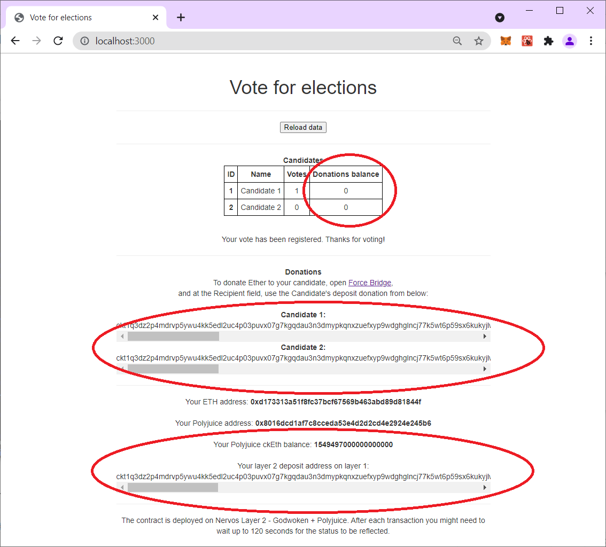
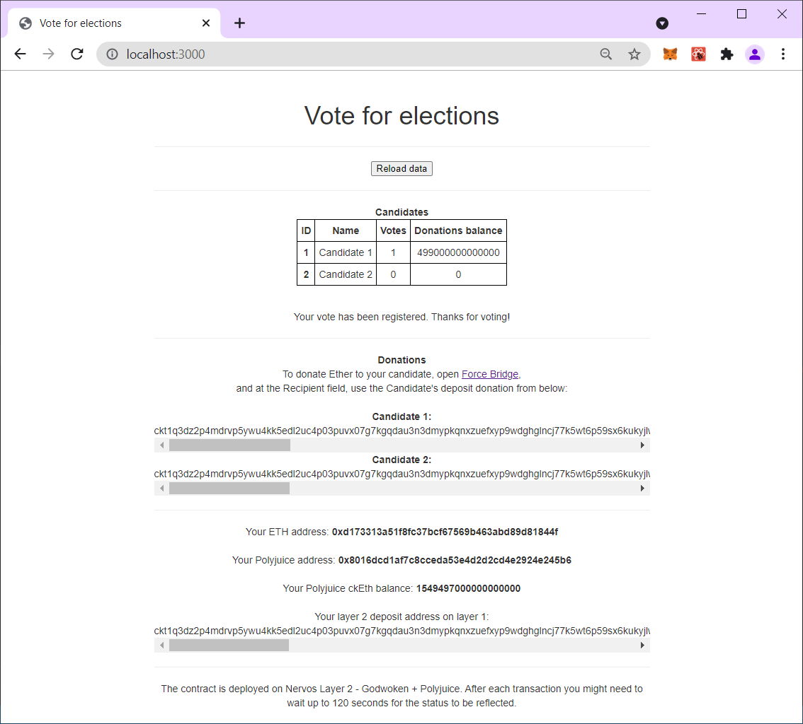

# Gitcoin: 8) Modify The Ported DApp So It Supports Ethereum Assets Via Force Bridge

For the previous task, I created an Elections dapp that allows the user to vote for a candidate.

For this task, I've added a "donation" functionality to the dapp:

Each candidate has in my contract an Ethereum address, where he can receive donations.

In this dapp, each candidate's Ethereum address is being converted to a layer 1 deposit address,

And if the user wants to donate, he is instructed to deposit Ethereum to this address via Force Bridge.

The app will then check the candidates' ckEth balance and display the donations.


I've also added the user's layer 1 deposit address, and the user's ckEth balance, because the task asked to do it (part 5).


## A screenshot or video of your EVM application on Layer 2 with Force Bridge support.
In the next image, you can see for the candidates and the user their deposit address and ckEth balance.

Note that at this point the donations balance for the candidates are empty.



After seeing this, the user deposited to Candidate 1's address via the Force Bridge. We can see the transfer succeeded and candidate 1's balance has grown.


## The address of the SUDT-ERC20 Proxy Contract that you deployed (in text format).
```
0x0D8b2881Cc4b800A3CD433F8441A202c8DB684fD
```

## A link to the GitHub repository with your EVM application that integrates Force Bridge support.
```
https://github.com/assafom/dapp-election
```
