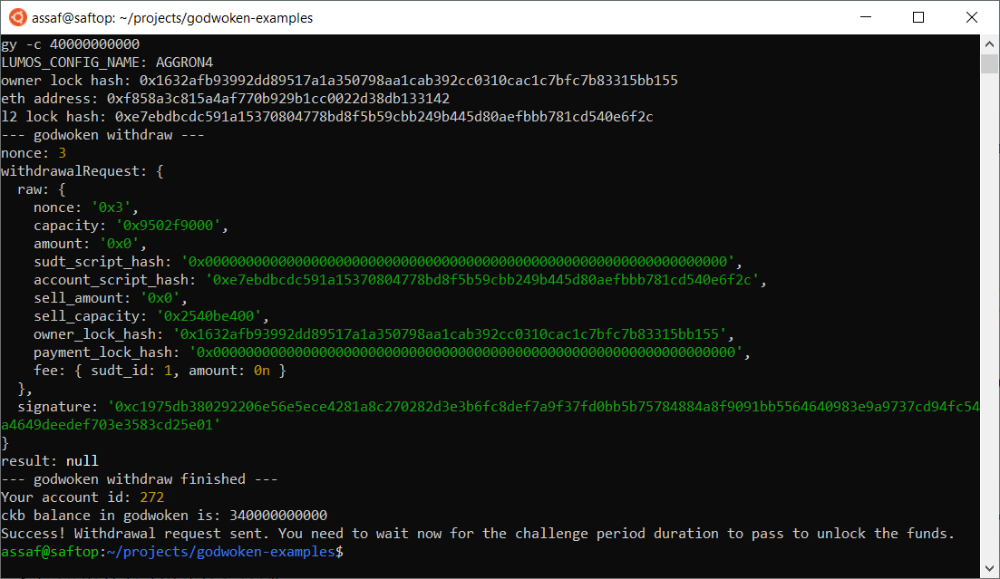

# Gitcoin: 9) Initiate Withdrawal Process From The Layer 2 Back To Layer 1

## 1. A screenshot of the console output immediately after running the withdraw command.

## 2. The Ethereum address that you've used for your Layer 2 account (in text format).
0xF858a3C815A4AF770b929B1Cc0022D38dB133142

## 3. The Nervos Layer 1 address that you passed to withdraw command (in text format).
ckt1qyqwy3ttzkuq7jppjrf2f9jweqvnk3tmgcjs9w0jgy
